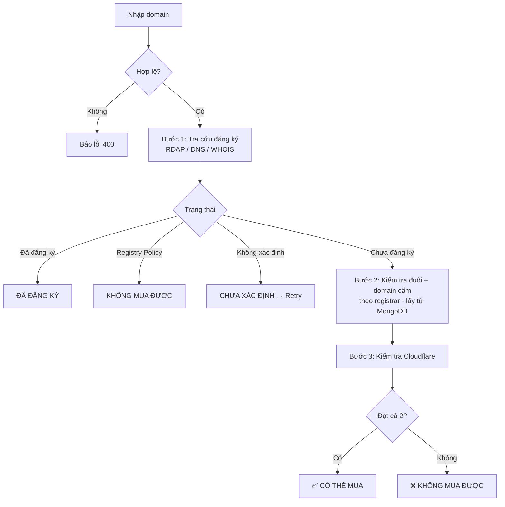

# 🔎 Domain Buy Checker (Ares)

Công cụ nội bộ giúp đội SEO **lọc nhanh domain nào mua được, mua ở đâu, có rủi ro gì và domain nào đủ điều kiện transfer** trước khi chi tiền. Nhập danh sách domain, hệ thống trả về kết luận cho từng domain chỉ sau vài giây.

🌐 **Trang đã triển khai:** [https://domain-checker-forseo-ares.onrender.com](https://domain-checker-forseo-ares.onrender.com)
*(cần tài khoản để đăng nhập, liên hệ quản trị viên để được cấp)*

> 🎯 **Mục tiêu:** giảm thời gian kiểm tra thủ công, tránh mua nhầm domain đã có chủ, bị registrar cấm hoặc bị Cloudflare chặn.

---

## 📌 Mục lục

1. [Các tab chức năng](#-các-tab-chức-năng)
2. [Tính năng chính (tab Kiểm tra mua domain)](#-tính-năng-chính-tab-kiểm-tra-mua-domain)
3. [Logic kiểm tra domain](#-logic-kiểm-tra-domain)
4. [Kiểm tra đủ điều kiện Transfer](#-kiểm-tra-đủ-điều-kiện-transfer)
5. [Kiểm tra giá GoDaddy (chỉ dẫn link)](#-kiểm-tra-giá-godaddy-chỉ-dẫn-link)
6. [Khu vực quản trị (chỉ admin)](#-khu-vực-quản-trị-chỉ-admin)
7. [Bảo mật](#-bảo-mật)
8. [Triển khai trên Render](#-triển-khai-trên-render)
9. [MongoDB Atlas](#-mongodb-atlas)
10. [Quản lý tài khoản](#-quản-lý-tài-khoản)
11. [Biến môi trường](#-biến-môi-trường)
12. [Giới hạn & lưu ý](#-giới-hạn--lưu-ý)

---

## 🗂️ Các tab chức năng

| Tab | Ai dùng được | Nội dung |
|---|---|---|
| ◈ **Kiểm tra mua domain** | Mọi tài khoản | Chức năng gốc: lọc domain mua được theo registrar + Cloudflare |
| ⇄ **Kiểm tra Transfer** | Mọi tài khoản | Domain đã đủ điều kiện transfer chưa (> 60 ngày, không bị chặn transfer) |
| $ **Kiểm tra giá GoDaddy** | Mọi tài khoản | Nút mở trang GoDaddy để xem giá mua mới / giá transfer |
| ⚙ **Đuôi cấm / cho phép** | Chỉ `admin` | Chỉnh đuôi bị cấm, đuôi cho phép đặc biệt, từ khóa cấm của từng nhà cung cấp |
| 🚫 **Domain cấm (ẩn)** | Chỉ `admin` | Danh sách domain bị cấm riêng theo từng nhà cung cấp |
| 👥 **Tài khoản** | Chỉ `admin` | Tạo, sửa, đặt lại mật khẩu, xóa tài khoản ngay trên website |

---

## ✨ Tính năng chính (tab Kiểm tra mua domain)

| Cột kết quả | Ý nghĩa |
|---|---|
| 🛒 **Trạng thái mua** | Kết luận cuối: có thể mua / không mua được / đã đăng ký / chưa xác định |
| 🏢 **Registrar** | Nhà đăng ký hiện tại của domain (nếu đã có chủ) |
| 🔒 **Status (hold/lock)** | Các trạng thái khóa của domain (clientHold, redemption...) |
| 📅 **Ngày đăng ký / hết hạn** | Lấy từ RDAP/WHOIS |
| ☁️ **Cloudflare** | Domain có thể thêm vào Cloudflare hay bị chặn (Banned) |

- Quét hàng loạt, có nút **Retry lỗi** cho các domain tra cứu thất bại.
- Có thể bật/tắt từng loại kiểm tra để quét nhanh hơn.
- Chỉ hiển thị **registrar nào cấm**. Domain mua được ở mọi nơi thì không hiển thị thêm thông tin thừa.
- Phần **"Tiêu chí cấm mua theo Registrar"** ở đầu tab tự cập nhật theo cấu hình mà admin đã chỉnh.

---

## 🧠 Logic kiểm tra domain

Mỗi domain đi qua 4 bước. Kết luận cuối cùng chỉ là **CÓ THỂ MUA** khi qua đủ các điều kiện.



### 1️⃣ Kiểm tra domain: đã đăng ký chưa?

Hệ thống thử lần lượt nhiều nguồn, **nguồn nào có dữ liệu thì dừng**, nhằm hạn chế báo lỗi:

| Thứ tự | Nguồn | Vai trò |
|---|---|---|
| 1 | **RDAP chính thức của từng đuôi domain** (danh sách lấy từ IANA, cache 24h) → dự phòng `rdap.org` | Nguồn đáng tin nhất, có thử lại khi timeout / 429 / 5xx |
| 2 | **DNS-over-HTTPS** (Cloudflare, Google): hỏi bản ghi NS | Bằng chứng phụ, rất nhanh |
| 3 | `who-dat` và `rdap.cloud` | Nguồn bổ sung khi RDAP không trả dữ liệu |
| 4 | **python-whois** (WHOIS port 43) | Xác nhận cuối, nhất là với đuôi không có RDAP |

**Quy tắc kết luận (ưu tiên từ trên xuống):**

| Kết luận | Điều kiện |
|---|---|
| 🚫 **Restricted** | RDAP 404 kèm nội dung "Registry Policy" (không được phép đăng ký) |
| 🔴 **Đã đăng ký** | Có thông tin registrar hoặc ngày đăng ký, **hoặc** DNS có NS đang chạy |
| 🟢 **Chưa đăng ký** | WHOIS xác nhận "no match" **và** có thêm RDAP 404 / nguồn trả rỗng / đuôi không có RDAP; hoặc RDAP 404 **và** DNS NXDOMAIN |
| 🟡 **Chưa xác định** | Mọi trường hợp còn lại, tức không đủ bằng chứng |

> 🛡️ **Nguyên tắc an toàn:** chỉ DNS NXDOMAIN **không đủ** để kết luận "chưa đăng ký", vì domain đã đăng ký nhưng bị khóa (clientHold) cũng trả NXDOMAIN. Không đủ bằng chứng thì hệ thống báo *chưa xác định* chứ không báo "mua được".

### 2️⃣ Kiểm tra đuôi domain và domain cấm theo từng registrar

Quy tắc **lưu trong MongoDB và admin chỉnh được** trên website. Cấu hình **mặc định** (khớp bản cũ) như sau:

| Registrar | Đuôi bị cấm mặc định |
|---|---|
| **Namecheap** | `.ch` `.li` `.cn` `.au` `.fr` `.ca` `.eu` `.eco` · `.uk` thuần (không tính `.co.uk`, `.org.uk`...) · `.in` có chứa chữ "india" |
| **GoDaddy** | Tất cả `.in` (kể cả `.co.in`, `.net.in`...) · `.cz` `.eu` `.dk` |
| **Dynadot** | `.it` `.org` |
| **Spaceship** | `.de` (cho phép `.uk`, `.my`) |
| **SAV** | Không có hạn chế |

**Cách khớp quy tắc** (mỗi nhà cung cấp có 3 danh sách: *bị cấm*, *cho phép đặc biệt*, *từ khóa cấm*):

| Cú pháp | Ý nghĩa |
|---|---|
| `.uk` | Cả đuôi `.uk` và mọi `.xx.uk` (`.co.uk`, `.org.uk`...) |
| `.co.uk` | Chỉ đúng đuôi `.co.uk` |
| `*.uk` | Chỉ các `.xx.uk`, **không** gồm `.uk` thuần |
| `.in:india` | Đuôi `.in` mà tên domain chứa `india` thì cấm |

- **Đuôi cụ thể hơn thắng đuôi chung** (thứ tự: đuôi đầy đủ → `*.xx` → đuôi cuối). Cùng mức mà có cả cấm lẫn cho phép thì **"cho phép" thắng**.
  Ví dụ Namecheap mặc định: cấm `.uk`, cho phép `*.uk` ⇒ chỉ `.uk` thuần bị cấm, `.co.uk` vẫn mua được.
- **Domain cấm riêng (danh sách ẩn):** domain nằm trong danh sách này sẽ bị tính là cấm tại các nhà cung cấp admin đã chọn, bất kể đuôi gì. Người dùng thường chỉ thấy kết quả "⛔ Cấm tại: ..." chứ không xem được danh sách.
- Hệ thống nhận diện đuôi 2 cấp (ví dụ `.co.uk`, `.com.au`) để áp đúng quy tắc.
- `tld_ok = true` khi **còn ít nhất 1 registrar** cho phép mua.
- Các registrar bị cấm được hiển thị ở dòng **⛔ Cấm tại: ...** để SEOer chọn nơi mua phù hợp.
- Cấu hình được **cache 20 giây**; admin lưu xong thì áp dụng ngay trên server đang chạy.

### 3️⃣ Kiểm tra Cloudflare

Hệ thống thử **thêm domain vào Cloudflare rồi xóa ngay** (qua API) để biết domain có bị Cloudflare từ chối hay không:

| Kết quả từ Cloudflare | Hiển thị | Ảnh hưởng |
|---|---|---|
| Thêm thành công | ✅ Sạch | Cho phép mua |
| Mã 1049 | ℹ️ Sạch (Chưa ĐK) | Dùng làm bằng chứng bổ sung là domain chưa đăng ký |
| Mã 1097 | ⛔ BANNED | Chặn mua |
| Mã 1095 | ⛔ Bị CF chặn add | Chặn mua |
| Mã 1116 | ⚠️ Đuôi TLD bị CF cấm | Chặn mua |
| Mã 1061 | ✅ Sạch (đã nằm trong CF khác) | Cho phép mua |
| Rate limit (429) / lỗi 5xx / timeout | ⚠️ Lỗi | Tính là *chưa xác định* → Retry |
| Chưa cấu hình token | Thiếu API CF | Bỏ qua bước này, không chặn |

> ⏱️ Các lần gọi Cloudflare được **giãn cách tự động** giữa mọi người dùng để tránh bị rate limit.

### 4️⃣ Kết luận cuối cùng

Domain được gắn **✅ CÓ THỂ MUA** khi thỏa **tất cả**:

1. Chưa đăng ký (xác nhận bằng ≥ 2 bằng chứng).
2. Còn ít nhất 1 registrar cho phép đuôi này (và domain không nằm trong danh sách cấm ở registrar đó).
3. Cloudflare không chặn và kiểm tra Cloudflare không bị lỗi.

| Nhãn | Ý nghĩa |
|---|---|
| ✅ **CÓ THỂ MUA** (kèm ⛔ Cấm tại...) | Mua được. Chỉ liệt kê registrar nào cấm |
| ❌ **KHÔNG MUA ĐƯỢC** | Registry Policy, mọi registrar đều cấm, hoặc Cloudflare chặn |
| ⚪ **ĐÃ ĐĂNG KÝ** | Domain đã có chủ |
| ⚠️ **CHƯA XÁC ĐỊNH** | Tra cứu lỗi, dùng nút **Retry lỗi** |

---

## ⇄ Kiểm tra đủ điều kiện Transfer

Tab dành cho **mọi tài khoản**. Nhập danh sách domain (mỗi dòng 1 domain), hệ thống dùng lại bộ tra cứu RDAP/DNS/WHOIS ở trên rồi kết luận:

| Nhãn | Điều kiện |
|---|---|
| ✅ **ĐỦ ĐIỀU KIỆN** | Đã đăng ký **hơn 60 ngày** và **không bị chặn transfer** |
| ❌ **CHƯA ĐỦ ĐIỀU KIỆN** | Vi phạm ít nhất 1 điều kiện, kèm lý do cụ thể (còn bao nhiêu ngày, khóa nào) |
| ⚪ **CHƯA ĐĂNG KÝ** | Domain chưa đăng ký, không có gì để transfer |
| ⚠️ **CHƯA XÁC ĐỊNH** | Tra cứu lỗi (dùng **Retry lỗi**) hoặc không lấy được ngày đăng ký để tính mốc 60 ngày |

**Các điều kiện được kiểm tra:**

- **Tuổi domain > 60 ngày** tính từ ngày đăng ký. Nếu RDAP có ghi lần transfer gần nhất thì cũng phải **> 60 ngày** kể từ lần đó.
- **Không bị chặn transfer:** `clientTransferProhibited`, `serverTransferProhibited`, `pendingTransfer`, `redemptionPeriod`, `pendingDelete`, `pendingRestore`, `serverHold`.
- Ngưỡng ngày có thể đổi bằng biến môi trường `TRANSFER_MIN_DAYS` (mặc định `60`).

> ℹ️ Dữ liệu lấy từ WHOIS/RDAP công khai nên chỉ mang tính tham khảo. Một số ccTLD có quy định riêng, và khi chuyển thật vẫn cần **mở khóa** và **mã Auth/EPP** từ registrar hiện tại.

---

## $ Kiểm tra giá GoDaddy (chỉ dẫn link)

Tab dành cho **mọi tài khoản**. Đây **chỉ là liên kết mở GoDaddy ở tab mới**, việc kiểm tra giá thực hiện trên GoDaddy, **không thực hiện trên website này**.

| Nút | Mở trang |
|---|---|
| Giá domain mua mới | https://www.godaddy.com/en/domains/bulk-domain-search |
| Giá transfer về GoDaddy | https://www.godaddy.com/en/domains/domain-transfer |

Lưu ý hiển thị ở đầu tab: *Nếu giá domain rẻ bất thường, vui lòng liên hệ IT mua domain để được hỗ trợ kiểm tra giá.*

---

## 🛠️ Khu vực quản trị (chỉ admin)

Chỉ tài khoản có tên đúng là **`admin`** mới thấy 3 tab quản trị và gọi được các API `/api/admin/*`. Tài khoản khác bị server chặn (HTTP 403), không chỉ ẩn nút.

### ⚙ Đuôi cấm / cho phép
- Mỗi nhà cung cấp có 3 ô: **đuôi bị cấm**, **đuôi cho phép đặc biệt**, **cấm theo từ khóa** (cú pháp ở [mục 2](#2️⃣-kiểm-tra-đuôi-domain-và-domain-cấm-theo-từng-registrar)).
- Bấm **Lưu** để áp dụng; **Khôi phục mặc định** để trả về cấu hình ban đầu của nhà cung cấp đó.
- Dữ liệu nhập sai định dạng sẽ bị từ chối kèm danh sách giá trị lỗi.

### 🚫 Domain cấm (ẩn)
- Dán danh sách domain (mỗi dòng 1 domain, hoặc cách nhau bằng dấu cách / phẩy; tự lọc `https://`, `www.`, đường dẫn, giá tiền đi kèm).
- Tick checkbox **1 hoặc nhiều nhà cung cấp** (có nút "Chọn tất cả") rồi bấm thêm. Thêm lại domain đã có sẽ **gộp** thêm nhà cung cấp.
- Danh sách có ô tìm kiếm; bỏ cấm từng nhà cung cấp bằng dấu `×` hoặc xóa cả domain. Mỗi lần thêm tối đa 2000 domain.

### 👥 Tài khoản
- **Tạo tài khoản:** tên đăng nhập 3–32 ký tự (chữ, số, `_` `.` `-`), mật khẩu tối thiểu 6 ký tự.
- Nút **🎲 Ngẫu nhiên** tạo mật khẩu 8 ký tự (có chữ hoa, chữ thường và số).
- **Sửa:** đổi tên đăng nhập và/hoặc đặt lại mật khẩu (để trống = giữ nguyên). **Xóa:** xóa tài khoản.
- Tên `admin` được **dành riêng**: không tạo trùng, không đổi tên, không xóa được tài khoản admin.
- Đổi mật khẩu hoặc xóa user thì user đó bị **đăng xuất** ở lần thao tác kế tiếp (tối đa trễ ~15 giây).
- Mật khẩu được **mã hóa khi lưu** nên không xem lại được. Hãy sao chép gửi cho người dùng ngay khi tạo; quên thì đặt lại.
- Tài khoản `admin` mặc định sẽ hiện **cảnh báo** cho đến khi đổi mật khẩu.

---

## 🔐 Bảo mật

- 🍪 Đăng nhập bằng **session cookie** (HttpOnly, SameSite, Secure trên Render), hết hạn sau 12 giờ.
- 🛡️ **CSRF token** cho cả form đăng nhập và mọi API (kể cả API quản trị).
- 🚫 Chặn đăng nhập sai: **5 lần / 10 phút**.
- ⏱️ Giới hạn **120 lượt `/api/check` (và `/api/transfer-check`) mỗi phút mỗi người dùng**; API quản trị có giới hạn riêng 120 lượt/phút.
- ✅ Kiểm tra định dạng domain **phía server**, không tin dữ liệu từ trình duyệt.
- 🧱 Security headers và **CSP**.
- 🔑 Mật khẩu lưu dạng **hash** (werkzeug), không lưu mật khẩu thô. Tên đăng nhập không phân biệt hoa/thường khi đăng nhập.
- 👑 **Phân quyền ở server:** quyền quản trị chỉ dành cho tài khoản tên `admin`; mọi API quản trị kiểm tra lại quyền, CSRF và phiên.
- ♻️ Phiên bị vô hiệu khi tài khoản bị xóa hoặc bị đổi mật khẩu.
- 🔒 **Fail-closed:** nếu không kết nối được MongoDB **và** không có `APP_USERS` thì app trả 503 và từ chối mọi truy cập.
- 🗄️ Dữ liệu người dùng, quy tắc và domain cấm nay lưu trong **MongoDB Atlas** (xem [mục MongoDB](#-mongodb-atlas)).

---

## 🚀 Triển khai trên Render

1. Đưa code lên GitHub (gồm `app.py`, `requirements.txt`, `render.yaml`).
2. **Thêm `pymongo[srv]` vào `requirements.txt`.** Nếu thiếu, app vẫn chạy nhưng chỉ dùng `APP_USERS` và quy tắc mặc định (các tab quản trị sẽ báo chưa kết nối được MongoDB).
3. Trên Render chọn **New → Blueprint** và trỏ tới repo (hoặc tạo Web Service thủ công).
4. Cấu hình theo `render.yaml`:
   - **Build:** `pip install -r requirements.txt`
   - **Start:** `gunicorn app:app --workers 1 --threads 8 --timeout 120 --access-logfile -`
   - **Health check:** `/healthz`
5. Điền các biến môi trường ở mục [bên dưới](#-biến-môi-trường), đặc biệt `MONGODB_URI`.

> ⚠️ Dùng **1 worker + nhiều thread** vì bộ đếm rate-limit nằm trong RAM, chia nhiều worker sẽ làm đếm sai.

### 💤 Giữ service không bị ngủ (gói Free)

Gói Free của Render tự tắt sau 15 phút không có truy cập. Dùng dịch vụ cron (ví dụ cron-job.org) ping định kỳ mỗi **10 phút** vào đường dẫn công khai:

```
https://<ten-service>.onrender.com/healthz
```

Đường dẫn này không yêu cầu đăng nhập và trả về `ok` (HTTP 200).

---

## 🍃 MongoDB Atlas

App dùng MongoDB Atlas (database mặc định `domain_checker`, đổi bằng `MONGODB_DB`). Khi khởi động app tự tạo index và dữ liệu mặc định nếu chưa có.

| Collection | Nội dung |
|---|---|
| `users` | Tài khoản (mật khẩu đã hash), thời gian tạo/cập nhật |
| `tld_rules` | Đuôi bị cấm / cho phép / từ khóa của từng nhà cung cấp |
| `domain_blocks` | Danh sách domain cấm riêng theo nhà cung cấp |

**Dữ liệu tạo tự động ở lần chạy đầu:**
- Tài khoản **`admin`** (mật khẩu mặc định do quản trị viên nắm; đổi được bằng `ADMIN_DEFAULT_PASSWORD` *trước lần chạy đầu*). **Hãy đổi mật khẩu ngay sau khi đăng nhập.** App chỉ tạo admin khi chưa có, **không ghi đè** mật khẩu ở các lần restart sau.
- Quy tắc đuôi mặc định cho 5 nhà cung cấp (bảng ở mục 2).

**Thiết lập trên Atlas:**
1. Vào **Network Access** và cho phép IP của Render (hoặc `0.0.0.0/0`), nếu không app không kết nối được.
2. Đặt chuỗi kết nối vào biến môi trường **`MONGODB_URI`** trên Render, **không để mật khẩu trong code/repo**. Nếu chuỗi kết nối từng bị lộ (gửi qua chat, commit lên GitHub...), hãy **đổi mật khẩu user Atlas** rồi cập nhật lại.
3. Nếu MongoDB tạm lỗi: app dùng quy tắc mặc định, tự thử kết nối lại mỗi ~20 giây; đăng nhập chỉ còn dùng được với `APP_USERS` (nếu có).

---

## 👥 Quản lý tài khoản

**Cách chính (khuyến nghị):** đăng nhập bằng `admin` → tab **👥 Tài khoản** để tạo / sửa / đặt lại mật khẩu / xóa. Không cần push lại code hay sửa biến môi trường.

**Cách cũ (vẫn hỗ trợ, làm dự phòng):** biến môi trường `APP_USERS`, định dạng:

```
user1:<hash1>;user2:<hash2>;user3:<hash3>
```

- Tài khoản trong MongoDB **được ưu tiên**: nếu trùng tên với `APP_USERS` thì dùng bản trong MongoDB.
- Tài khoản từ `APP_USERS` hiện ở tab Tài khoản dưới dạng **chỉ đọc** (không sửa/xóa trên web).
- Tạo hash: `python app.py hash`
- Tạo hàng loạt (tự sinh mật khẩu ngẫu nhiên): `python gen_users.py -f names.txt` → `app_users.txt` (dán vào `APP_USERS`) và `credentials.csv` (gửi cho nhân viên, **xóa sau khi gửi**).

---

## ⚙️ Biến môi trường

| Biến | Bắt buộc | Mô tả |
|---|:---:|---|
| `MONGODB_URI` | ✅ | Chuỗi kết nối MongoDB Atlas (`mongodb+srv://...`). Nên đặt ở Render, không để trong code |
| `SECRET_KEY` | ✅ | Khóa ký session. `render.yaml` tự sinh và giữ cố định |
| `MONGODB_DB` | ⭕ | Tên database, mặc định `domain_checker` |
| `ADMIN_DEFAULT_PASSWORD` | ⭕ | Mật khẩu của `admin` khi tạo lần đầu (chỉ có tác dụng nếu admin chưa tồn tại) |
| `APP_USERS` | ⭕ | Tài khoản dự phòng/cũ `user:hash;user:hash` (không còn bắt buộc khi đã có MongoDB) |
| `TRANSFER_MIN_DAYS` | ⭕ | Số ngày tối thiểu để đủ điều kiện transfer, mặc định `60` |
| `CF_API_TOKEN` | ⭕ | API token Cloudflare (có quyền tạo / xóa zone) |
| `CF_ACCOUNT_ID` | ⭕ | Account ID Cloudflare |
| `SESSION_HOURS` | ⭕ | Thời gian phiên đăng nhập, mặc định `12` |
| `API_LIMIT_PER_MIN` | ⭕ | Giới hạn lượt check / phút / user, mặc định `120` |
| `LOGIN_MAX_FAILS` | ⭕ | Số lần đăng nhập sai tối đa, mặc định `5` |
| `LOGIN_WINDOW_SEC` | ⭕ | Khoảng thời gian tính số lần sai, mặc định `600` |
| `LOOKUP_BUDGET_SEC` | ⭕ | Thời gian tối đa tra cứu 1 domain, mặc định `22` |
| `CF_MIN_INTERVAL` | ⭕ | Giãn cách giữa 2 lần gọi Cloudflare (giây), mặc định `0.35` |

✅ bắt buộc · ⭕ tùy chọn

---

## ⚠️ Giới hạn & lưu ý

- 📋 Kết quả mang tính **tham khảo**. Việc mua được hay không còn phụ thuộc thời điểm và quy định riêng của từng nhà cung cấp.
- 🧪 **Ánh xạ mã lỗi Cloudflare** (1049, 1097, 1095, 1116, 1061) được giữ nguyên từ phiên bản đầu và **chưa đối chiếu với tài liệu chính thức** của Cloudflare. Cần xác nhận trước khi dùng làm cơ sở quyết định lớn.
- ☁️ Bước kiểm tra Cloudflare **tạo rồi xóa zone tạm** trong tài khoản Cloudflare được cấu hình. Nên dùng tài khoản và token riêng cho công cụ này.
- 🌐 Tên domain được gửi tới các dịch vụ tra cứu bên thứ ba (RDAP, DNS-over-HTTPS, `who-dat`, `rdap.cloud`). Không nhập domain nhạy cảm chưa công bố nếu có yêu cầu bảo mật.
- 🔄 Bộ đếm rate-limit nằm trong RAM nên **reset khi service restart hoặc ngủ**. Phiên đăng nhập vẫn giữ miễn là `SECRET_KEY` không đổi.
- 🐢 Gói Free của Render có thể chậm ở lần truy cập đầu sau khi service ngủ (cộng thêm vài giây kết nối MongoDB).
- ⇄ Kết quả **Transfer** phụ thuộc dữ liệu WHOIS/RDAP; một số đuôi không công khai ngày đăng ký hoặc trạng thái khóa nên sẽ báo *chưa xác định*.
- Một số domain vẫn có thể ở trạng thái *chưa xác định* khi mọi nguồn tra cứu cùng lỗi. Dùng nút **Retry lỗi**.

---

<p align="center">Made for the SEO team 🚀</p>
