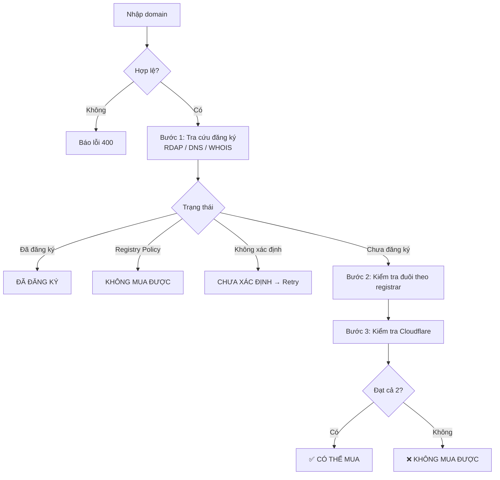

# 🔎 Domain Buy Checker (Ares)

Công cụ nội bộ giúp đội SEO **lọc nhanh domain nào mua được, mua ở đâu và có rủi ro gì** trước khi chi tiền. Nhập danh sách domain, hệ thống trả về kết luận cho từng domain chỉ sau vài giây.

> 🎯 **Mục tiêu:** giảm thời gian kiểm tra thủ công, tránh mua nhầm domain đã có chủ, bị registrar cấm hoặc bị Cloudflare chặn.

---

## 📌 Mục lục

1. [Tính năng chính](#-tính-năng-chính)
2. [Logic kiểm tra domain](#-logic-kiểm-tra-domain)
3. [Bảo mật](#-bảo-mật)
4. [Triển khai trên Render](#-triển-khai-trên-render)
5. [Quản lý tài khoản](#-quản-lý-tài-khoản)
6. [Biến môi trường](#-biến-môi-trường)
7. [Giới hạn & lưu ý](#-giới-hạn--lưu-ý)

---

## ✨ Tính năng chính

| Cột kết quả | Ý nghĩa |
|---|---|
| 🛒 **Trạng thái mua** | Kết luận cuối: có thể mua / không mua được / đã đăng ký / chưa xác định |
| 🏢 **Registrar** | Nhà đăng ký hiện tại của domain (nếu đã có chủ) |
| 🔒 **Status (hold/lock)** | Các trạng thái khóa của domain (clientHold, redemption...) |
| 📅 **Ngày đăng ký / hết hạn** | Lấy từ RDAP/WHOIS |
| ☁️ **Cloudflare** | Domain có thể thêm vào Cloudflare hay bị chặn (Banned) |

- Quét hàng loạt, có nút **Retry lỗi** cho các domain tra cứu thất bại.
- Có thể bật/tắt từng loại kiểm tra để quét nhanh hơn.
- Chỉ hiển thị **registrar nào cấm**. Domain mua được ở mọi nơi thì không hiển thị thêm thông tin thừa.

---

## 🧠 Logic kiểm tra domain

Mỗi domain đi qua 4 bước. Kết luận cuối cùng chỉ là **CÓ THỂ MUA** khi qua đủ các điều kiện.



### 1️⃣ Kiểm tra domain: đã đăng ký chưa?

Hệ thống thử lần lượt nhiều nguồn, **nguồn nào có dữ liệu thì dừng**, nhằm hạn chế báo lỗi:

| Thứ tự | Nguồn | Vai trò |
|---|---|---|
| 1 | **RDAP chính thức của từng đuôi domain** (danh sách lấy từ IANA, cache 24h) → dự phòng `rdap.org` | Nguồn đáng tin nhất, có thử lại khi timeout / 429 / 5xx |
| 2 | **DNS-over-HTTPS** (Cloudflare, Google): hỏi bản ghi NS | Bằng chứng phụ, rất nhanh |
| 3 | `who-dat` và `rdap.cloud` | Nguồn bổ sung khi RDAP không trả dữ liệu |
| 4 | **python-whois** (WHOIS port 43) | Xác nhận cuối, nhất là với đuôi không có RDAP |

**Quy tắc kết luận (ưu tiên từ trên xuống):**

| Kết luận | Điều kiện |
|---|---|
| 🚫 **Restricted** | RDAP 404 kèm nội dung "Registry Policy" (không được phép đăng ký) |
| 🔴 **Đã đăng ký** | Có thông tin registrar hoặc ngày đăng ký, **hoặc** DNS có NS đang chạy |
| 🟢 **Chưa đăng ký** | WHOIS xác nhận "no match" **và** có thêm RDAP 404 / nguồn trả rỗng / đuôi không có RDAP; hoặc RDAP 404 **và** DNS NXDOMAIN |
| 🟡 **Chưa xác định** | Mọi trường hợp còn lại, tức không đủ bằng chứng |

> 🛡️ **Nguyên tắc an toàn:** chỉ DNS NXDOMAIN **không đủ** để kết luận "chưa đăng ký", vì domain đã đăng ký nhưng bị khóa (clientHold) cũng trả NXDOMAIN. Không đủ bằng chứng thì hệ thống báo *chưa xác định* chứ không báo "mua được".

### 2️⃣ Kiểm tra đuôi domain theo từng registrar

Domain đã chạy qua danh sách đuôi bị cấm của từng registrar:

| Registrar | Đuôi bị cấm |
|---|---|
| **Namecheap** | `.ch` `.li` `.cn` `.au` `.fr` `.ca` `.eu` `.eco` · `.uk` thuần (không tính `.co.uk`, `.org.uk`...) · `.in` có chứa chữ "india" |
| **GoDaddy** | Tất cả `.in` (kể cả `.co.in`, `.net.in`...) · `.cz` `.eu` `.dk` |
| **Dynadot** | `.it` `.org` |
| **Spaceship** | `.de` (cho phép `.uk`, `.my`) |
| **SAV** | Không có hạn chế |

- Hệ thống nhận diện đuôi 2 cấp (ví dụ `.co.uk`, `.com.au`) để áp đúng quy tắc.
- `tld_ok = true` khi **còn ít nhất 1 registrar** cho phép mua.
- Các registrar bị cấm được hiển thị ở dòng **⛔ Cấm tại: ...** để SEOer chọn nơi mua phù hợp.

### 3️⃣ Kiểm tra Cloudflare

Hệ thống thử **thêm domain vào Cloudflare rồi xóa ngay** (qua API) để biết domain có bị Cloudflare từ chối hay không:

| Kết quả từ Cloudflare | Hiển thị | Ảnh hưởng |
|---|---|---|
| Thêm thành công | ✅ Sạch | Cho phép mua |
| Mã 1049 | ℹ️ Sạch (Chưa ĐK) | Dùng làm bằng chứng bổ sung là domain chưa đăng ký |
| Mã 1097 | ⛔ BANNED | Chặn mua |
| Mã 1095 | ⛔ Bị CF chặn add | Chặn mua |
| Mã 1116 | ⚠️ Đuôi TLD bị CF cấm | Chặn mua |
| Mã 1061 | ✅ Sạch (đã nằm trong CF khác) | Cho phép mua |
| Rate limit (429) / lỗi 5xx / timeout | ⚠️ Lỗi | Tính là *chưa xác định* → Retry |
| Chưa cấu hình token | Thiếu API CF | Bỏ qua bước này, không chặn |

> ⏱️ Các lần gọi Cloudflare được **giãn cách tự động** giữa mọi người dùng để tránh bị rate limit.

### 4️⃣ Kết luận cuối cùng

Domain được gắn **✅ CÓ THỂ MUA** khi thỏa **tất cả**:

1. Chưa đăng ký (xác nhận bằng ≥ 2 bằng chứng).
2. Còn ít nhất 1 registrar cho phép đuôi này.
3. Cloudflare không chặn và kiểm tra Cloudflare không bị lỗi.

| Nhãn | Ý nghĩa |
|---|---|
| ✅ **CÓ THỂ MUA** (kèm ⛔ Cấm tại...) | Mua được. Chỉ liệt kê registrar nào cấm |
| ❌ **KHÔNG MUA ĐƯỢC** | Registry Policy, mọi registrar đều cấm, hoặc Cloudflare chặn |
| ⚪ **ĐÃ ĐĂNG KÝ** | Domain đã có chủ |
| ⚠️ **CHƯA XÁC ĐỊNH** | Tra cứu lỗi, dùng nút **Retry lỗi** |

---

## 🔐 Bảo mật

- 🍪 Đăng nhập bằng **session cookie** (HttpOnly, SameSite, Secure trên Render), hết hạn sau 12 giờ.
- 🛡️ **CSRF token** cho cả form đăng nhập và API.
- 🚫 Chặn đăng nhập sai: **5 lần / 10 phút**.
- ⏱️ Giới hạn **120 lượt `/api/check` mỗi phút mỗi người dùng**.
- ✅ Kiểm tra định dạng domain **phía server**, không tin dữ liệu từ trình duyệt.
- 🧱 Security headers và **CSP**.
- 🔑 Mật khẩu lưu dạng **hash** (werkzeug), không lưu mật khẩu thô.
- 🔒 **Fail-closed:** thiếu `APP_USERS` thì app trả 503 và từ chối mọi truy cập, không mở cửa.
- Không dùng database nên không có dữ liệu người dùng nằm trên máy chủ ngoài biến môi trường.

---

## 🚀 Triển khai trên Render

1. Đưa code lên GitHub (gồm `app.py`, `requirements.txt`, `render.yaml`).
2. Trên Render chọn **New → Blueprint** và trỏ tới repo (hoặc tạo Web Service thủ công).
3. Cấu hình theo `render.yaml`:
   - **Build:** `pip install -r requirements.txt`
   - **Start:** `gunicorn app:app --workers 1 --threads 8 --timeout 120 --access-logfile -`
   - **Health check:** `/healthz`
4. Điền các biến môi trường ở mục [bên dưới](#-biến-môi-trường).

> ⚠️ Dùng **1 worker + nhiều thread** vì bộ đếm rate-limit nằm trong RAM, chia nhiều worker sẽ làm đếm sai.

### 💤 Giữ service không bị ngủ (gói Free)

Gói Free của Render tự tắt sau 15 phút không có truy cập. Dùng dịch vụ cron (ví dụ cron-job.org) ping định kỳ mỗi **10 phút** vào đường dẫn công khai:

```
https://<ten-service>.onrender.com/healthz
```

Đường dẫn này không yêu cầu đăng nhập và trả về `ok` (HTTP 200).

---

## 👥 Quản lý tài khoản

Tài khoản lưu trong biến môi trường `APP_USERS`, định dạng:

```
user1:<hash1>;user2:<hash2>;user3:<hash3>
```

**Tạo hash cho 1 tài khoản:**

```bash
python app.py hash
```

**Tạo hàng loạt cho nhiều nhân viên** (tự sinh mật khẩu ngẫu nhiên):

```bash
python gen_users.py -f names.txt
```

Script tạo ra `app_users.txt` (dán vào `APP_USERS` trên Render) và `credentials.csv` (gửi cho nhân viên, **xóa sau khi gửi**).

> 💡 Thêm / xóa tài khoản chỉ cần sửa biến `APP_USERS` trên Render. **Không cần push lại code.**

---

## ⚙️ Biến môi trường

| Biến | Bắt buộc | Mô tả |
|---|:---:|---|
| `APP_USERS` | ✅ | Danh sách tài khoản `user:hash;user:hash` |
| `SECRET_KEY` | ✅ | Khóa ký session. `render.yaml` tự sinh và giữ cố định |
| `CF_API_TOKEN` | ⭕ | API token Cloudflare (có quyền tạo / xóa zone) |
| `CF_ACCOUNT_ID` | ⭕ | Account ID Cloudflare |
| `SESSION_HOURS` | ⭕ | Thời gian phiên đăng nhập, mặc định `12` |
| `API_LIMIT_PER_MIN` | ⭕ | Giới hạn lượt check / phút / user, mặc định `120` |
| `LOGIN_MAX_FAILS` | ⭕ | Số lần đăng nhập sai tối đa, mặc định `5` |
| `LOGIN_WINDOW_SEC` | ⭕ | Khoảng thời gian tính số lần sai, mặc định `600` |
| `LOOKUP_BUDGET_SEC` | ⭕ | Thời gian tối đa tra cứu 1 domain, mặc định `22` |
| `CF_MIN_INTERVAL` | ⭕ | Giãn cách giữa 2 lần gọi Cloudflare (giây), mặc định `0.35` |

✅ bắt buộc · ⭕ tùy chọn

---

## ⚠️ Giới hạn & lưu ý

- 📋 Kết quả mang tính **tham khảo**. Việc mua được hay không còn phụ thuộc thời điểm và quy định riêng của từng nhà cung cấp.
- 🧪 **Ánh xạ mã lỗi Cloudflare** (1049, 1097, 1095, 1116, 1061) được giữ nguyên từ phiên bản đầu và **chưa đối chiếu với tài liệu chính thức** của Cloudflare. Cần xác nhận trước khi dùng làm cơ sở quyết định lớn.
- ☁️ Bước kiểm tra Cloudflare **tạo rồi xóa zone tạm** trong tài khoản Cloudflare được cấu hình. Nên dùng tài khoản và token riêng cho công cụ này.
- 🌐 Tên domain được gửi tới các dịch vụ tra cứu bên thứ ba (RDAP, DNS-over-HTTPS, `who-dat`, `rdap.cloud`). Không nhập domain nhạy cảm chưa công bố nếu có yêu cầu bảo mật.
- 🔄 Bộ đếm rate-limit nằm trong RAM nên **reset khi service restart hoặc ngủ**. Phiên đăng nhập vẫn giữ miễn là `SECRET_KEY` không đổi.
- 🐢 Gói Free của Render có thể chậm ở lần truy cập đầu sau khi service ngủ.
- Một số domain vẫn có thể ở trạng thái *chưa xác định* khi mọi nguồn tra cứu cùng lỗi. Dùng nút **Retry lỗi**.

---

<p align="center">Made for the SEO team 🚀</p>
